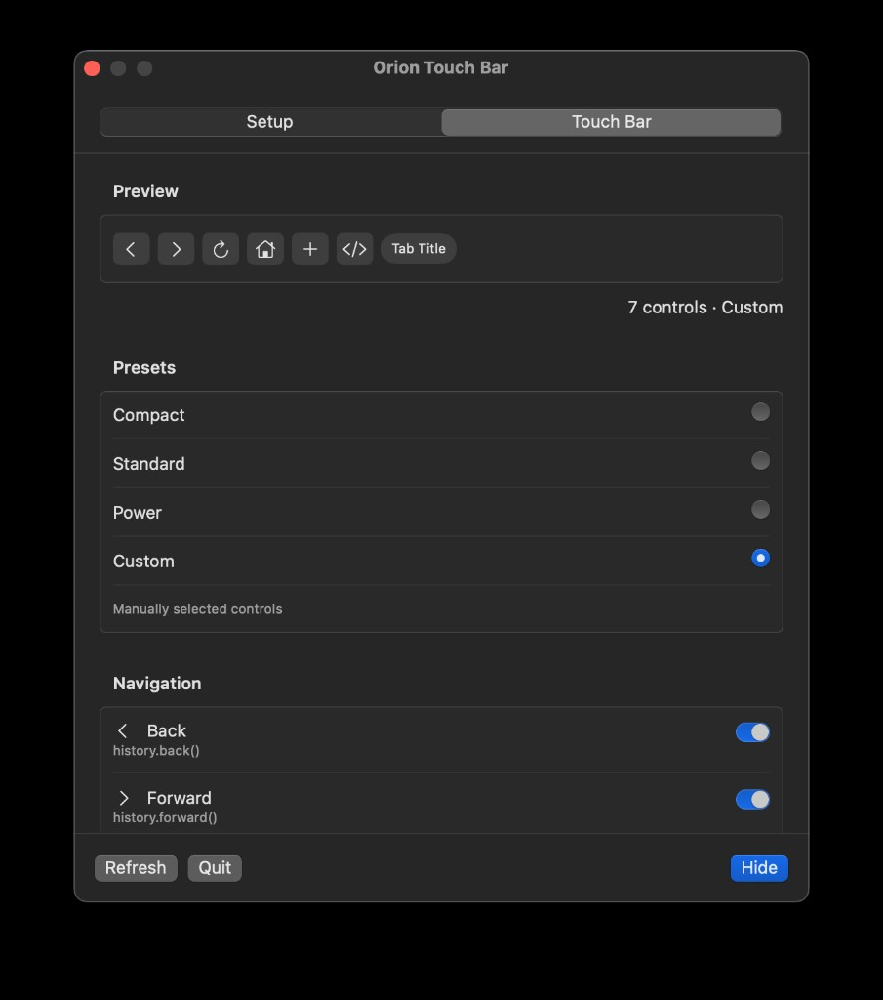
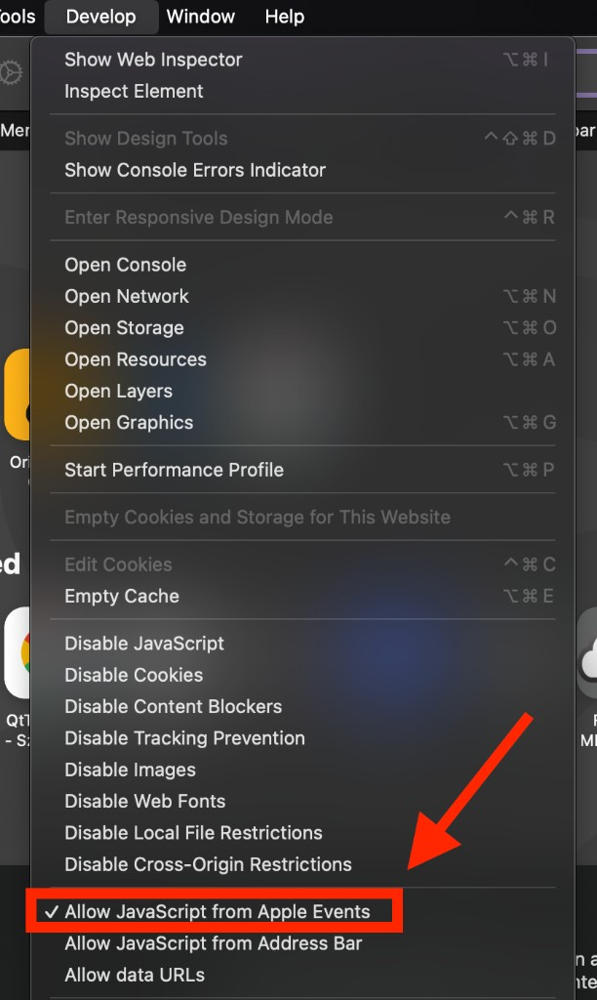

# Orion Touch Bar
<p align="center">
  
</p>

A small helper app that gives [Orion](https://browser.kagi.com/) a Touch Bar with back, forward, reload buttons and more!

<p align="center">
  
</p>

**Requirements:** 
* a Mac with a Touch Bar
* macOS 13+ (would love to lower that requirement)
* [Orion](https://browser.kagi.com/)

## Install

### Download (recommended)

[Download the latest installer DMG](https://github.com/smartfrigde/OrionTouchBarPatch/releases/latest/download/OrionTouchBar-1.0.dmg)

1. Download the latest **.dmg** (see above).
2. Open the disk image and drag **Orion Touch Bar** into **Applications**.
3. Eject the disk image.
4. Open the app once (right-click → **Open** if Gatekeeper complains on an unsigned build).
5. Grant the permissions it asks for (see below).
6. Focus the Orion window, now your Touch Bar should show the browser controls.
7. In Orion, enable **Develop → Allow JavaScript from Apple Events** (see below).

The app runs in the background. Open it again from Launchpad anytime to change settings or quit.

### Build from source

1. Install Xcode 15+ from the Mac App Store.
2. Clone this repo and open the project:

   ```bash
   git clone https://github.com/smartfrigde/OrionTouchBarPatch.git
   cd OrionTouchBarPatch
   open OrionTouchBarPatch.xcodeproj
   ```

3. Select the **OrionTouchBarPatch** scheme → **My Mac**.
4. Product → **Run** (⌘R), or build from the terminal:

   ```bash
   xcodebuild -scheme OrionTouchBarPatch -configuration Release \
     -destination 'platform=macOS' \
     -derivedDataPath ./DerivedData \
     build
   ```

   The app lands at:

   `DerivedData/Build/Products/Release/OrionTouchBarPatch.app`

### Package a drag-to-Applications DMG

```bash
brew install create-dmg
./scripts/package-dmg.sh
```

Output: `dist/OrionTouchBar-<version>.dmg` (version from `MARKETING_VERSION` in the Xcode project).

Optional Developer ID signing + notarization (paid Apple Developer Program; Gatekeeper-friendly downloads):

```bash
# One-time: store notarization credentials
xcrun notarytool store-credentials "notarytool-profile" \
  --apple-id "you@example.com" \
  --team-id "YOUR_TEAM_ID" \
  --password "app-specific-password"

./scripts/package-dmg.sh \
  --sign "Developer ID Application: Your Name (TEAMID)" \
  --notarize notarytool-profile
```

Without signing, users may need right-click → **Open** the first time. Upload the DMG as a GitHub Release asset named `OrionTouchBar-<version>.dmg`.

## First-run setup

On first launch you’ll get a simple settings window:

1. **Setup** - allow Automation for Orion and System Events (and Accessibility if shortcuts feel flaky). Optionally turn on **Open at Login**.
2. **In Orion** - turn on **Allow JavaScript from Apple Events** (required for Back / Forward / Reload).
3. **Touch Bar** - pick a preset or toggle individual controls. The preview updates as you go.
4. Click **Start in Background** (or **Hide** later). The window goes away; the helper keeps running.

Reopen the app from Launchpad to tweak the layout or quit.

### Allow JavaScript from Apple Events

Back, Forward, and Reload talk to the page through AppleScript’s `do JavaScript`. Orion blocks that until you enable it:

1. Open **Orion**.
2. Open the **Develop** menu.
3. Enable **Allow JavaScript from Apple Events** (leave the checkmark on).

<p align="center">
  
</p>

If you don’t see **Develop**, turn that menu on in Orion’s settings first, then enable the option above.

### Permissions

| Permission | Why it’s needed |
|---|---|
| Automation → **Orion** | Read the tab title, run page navigation, close tab, copy URL |
| Automation → **System Events** | Send shortcuts (new tab, address bar, zoom, inspector, …) |
| **Allow JavaScript from Apple Events** (in Orion) | Back, Forward, Reload via `do JavaScript` |
| Accessibility | Optional; helps keystrokes reach Orion reliably |
| Open at Login | Optional |

## What you can put on the Touch Bar

| Control | What it does |
|---|---|
| Back / Forward / Reload | Page history and refresh |
| Hard Reload | Reload ignoring cache (⇧⌘R) |
| Home | Home page (⇧⌘H) |
| New Tab / Close Tab | Tab management |
| Previous / Next Tab | Switch tabs |
| Focus Address Bar | Jump to the URL field (⌘L) |
| Copy URL | Copy the current tab’s URL |
| Find in Page | ⌘F |
| Focus Mode | Orion Focus Mode (⇧⌘F) |
| Zoom − / + | Page zoom |
| Tab Title | Shows the current tab name |
| Web Inspector | Develop tools (⌥⌘I) |

**Presets:** 
* Compact (default)

* Standard

* Power 

* ...or build your own mix (Custom)

## Troubleshooting

- If Back / Forward / Reload do nothing, confirm **Develop → Allow JavaScript from Apple Events** is checked in Orion.
- If New Tab opens a window instead of a tab, make sure System Events (and Accessibility if needed) are allowed.

### Known limits

- Shortcut-based actions assume Orion’s default key bindings. We should move more stuff to AppleScript so it works even if the user remaps keys.
- This is an overlay, which means the pre 2019 TouchBar Macs loose their non-physical Escape key. The dismissal button appears instead, if you have any ideas on how to cumbersomely fix that, please open an issue!
- Sometimes the accesibility permission glitches. Remove the app from System Preferences → Security & Privacy → Accessibility and re-add it if keystrokes don’t reach Orion.

#### Orion and Kagi are trademarks of their respective owners. This project is not affiliated with Kagi Inc.